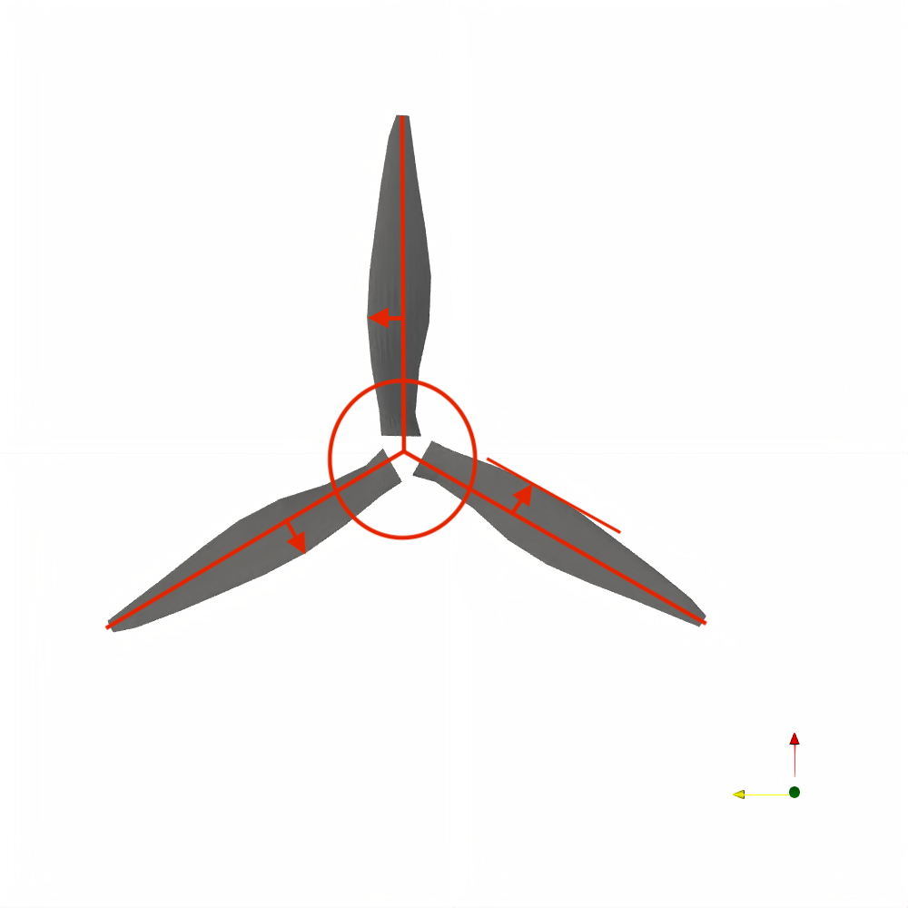

# How to Define a Custom Rotor

It is likely that the rotors defined in the repository database do not match your needs, in that case, you will need to provide all of the information to define the rotor in a series of files. The files must be defined in the correct format and directory structure for FlowUnsteady to find it all. If you are unfamiliar with creating file trees, we suggest adding your files directly to the correct directories, however a seperate file structure can easily be used.


## Creating a Custom Rotor
If you do not already have the rotor files to describe your rotor, then you will need to create them. Here we will go through each file type and what to put in them. It is important to note that file name and types are not important, however they must be comma delimited.  We will use the DJI-II from the FLOWUnsteady database as an example.

It is important to note that if XFOIL is not run (marked false), then airfoil polars must be provided. The files that affect solution outcome are the chord distribution, pitch distribution, leading edge distribution, and airfoil polar files. If XFOIL is marked to run, all of the geometric material must be accurate.

Below, we describe the files (and give the default file name), their contents, and provide code that can be used to create them.

### Main File (e.g. data/rotors/DJI-II.csv)

The main file describes the overall rotor, and points to the blade file that describes one of the blades.

| property | file             | description             |
| -------- | ---------------- | ----------------------- |
| Rtip     | 0.12             | (m) Radius of blade tip |
| Rhub     | 0.00823          | (m) Radius of hub       |
| B        | 2                | Number of blades        |
| blade    | DJI-II_blade.csv | Blade file              |


### Blade File (e.g. data/rotors/DJI-II_blade.csv)

This file contains file names for the various blade definition parameters as well as parameters for spline definitions.

| property      | file                  | description            |
| ------------- | --------------------- | ---------------------- |
| chorddist     | DJI-II_chorddist.csv  | Chord distribution     |
| pitchdist     | DJI-II_pitchdist.csv  | Pitch distribution     |
| sweepdist     | DJI-II_sweepdist.csv  | LE sweep distribution  |
| heightdist    | DJI-II_heightdist.csv | LE height distribution |
| airfoil_files | DJI-II_airfoils.csv   | Airfoil distribution   |
| spl_k         | 1                     | Spline order           |
| spl_s         | 2.0e-7                | Spline smoothing       |


### Chord Distribution File (e.g. data/rotors/DJI-II_chorddist.csv)

This file provides the distribution of the chord along the blade, normalized by the tip radius of the blade. The file must go in order from root to tip. The root need not be defined, but the tip must be. The file can have any number of paired numbers. Any values used by the solver that are not provided will be interpolated.

| r/R       | c/R       |
| --------- | --------- |
| 0.0411523 | 0.121011  |
| 0.0685871 | 0.138171  |
| ...       | ...       |
| 1.0       | 0.0978361 |


### Pitch Distribution File (e.g. data/rotors/DJI-II_pitchdist.csv)

This file describes the twist of the blade along the blade. The file can have any number of paired numbers. Any values used by the solver that are not provided will be interpolated.

| r/R       | twist (deg) |
| --------- | ----------- |
| 0.0411523 | 16.4567     |
| 0.0685871 | 17.5        |
| ...       | ...         |
| 1.0       | 11.6        |


### Sweep Distribution File (e.g. data/rotors/DJI-II_sweepdist.csv)

This file describes the sweep distribution. This is also known as the leading edge distribution, it describes the distance of the the leading edge from a line coming from the center of the hub. These lines change depending on how many blades are included on a rotor (see photo below for example of a the rotor with 3 blades). The file can have any number of paired numbers. Any values used by the solver that are not provided will be interpolated.

```@raw html

```

| r/R       | y/R (y-distance of LE from the middle point of hub) |
| --------- | --------------------------------------------------- |
| 0.0411523 | 0.0576211                                           |
| 0.0685871 | 0.0605955                                           |
| ...       | ...                                                 |
| 1.0       | 0.0344412                                           |


### Height Distribution File (e.g. data/rotors/DJI-II_heightdist.csv)

This file describes the height distribution, also known as anhedral (or precode for turbines). This describes the height of the leading edge from the top face of the hub. The file can have any number of paired numbers. Any values used by the solver that are not provided will be interpolated.

```@raw html

```

| r/R       | z/R (height of LE from the top face of hub) |
| --------- | ------------------------------------------- |
| 0.0686391 | -0.00242965                                 |
| 0.2       | 0.00728895                                  |
| ...       | ...                                         |
| 1.0       | -0.0242965                                  |


### Airfoil Section Definition File (e.g. data/rotors/DJI-II_airfoils.csv)

This file describes the airfoils along the blade and the paired aerodynamic data file that goes with the contour file. The contour file is a file of the geometric shape of the airfoil. The aero file is the airfoil polar, that is, the file that has the coefficient of lift, drag and moment for a given set of angles of attack for the airfoil. Note that the information is interpolated, so airfoils between two stated airfoils will be an interpolation between the two. If XFOIL is marked to run, then the aero files will not be used. As many pairs of airfoil files as desired may be used.

| r/R  | Contour file | Aero file               |
| ---- | ------------ | ----------------------- |
| 0.0  | e856-il.csv  | xf-e856-il-50000-n5.csv |
| 0.3  | e63.csv      | xf-e63-il-50000-n5.csv  |
| 1.0  | e63.csv      | xf-e63-il-50000-n5.csv  |


### Airfoil Geometry Files (e.g. data/airfoils/e63.csv)

These files describes the geometry of the airfoil by giving x and y coordinates of the airfoil surface. These coordinates are normalized by the chord length. The order of the points should be trailing edge, upper surface, leading edge, lower surface, then trailing edge. As many coordinate pairs as desired may be used, all other points used will be interpolated.

| x/c     | y/c     |
| ------- | ------- |
| 1.0     | 0.0     |
| 0.99619 | 0.00144 |
| ...     | ...     |
| 1.0     | 0.0     |


### Airfoil Polar Files (e.g. data/airfoils/xf-e63-il-50000-n5.csv)

These files contains all of the airfoil coefficients of lift, drag and moment for a given set of angles of attack for the airfoil. Values that are required but not given will be interpolated. Note that the polar should match the general Reynolds number that the given section will experience. If XFOIL is set to run, this file will not be used.

|Alpha |Cl     |Cd     |Cdp    |Cm     |Top_Xtr|Bot_Xtr|
| ---- | ----- | ----- | ----- | ----- | ----- | ----- |
|-7.750|-0.3633|0.11634|0.10945|-0.0220|1.0000 |0.0585 |
|-7.500|-0.3685|0.11553|0.10875|-0.0216|1.0000 |0.0590 |
|-7.250|-0.3745|0.11473|0.10806|-0.0210|1.0000 |0.0593 |
| ...  | ...   | ...   | ...   | ...   | ...   | ...   |
|10.750|1.3119 |0.10187|0.09684|-0.1098|0.0306 |1.0000 |


## Rotor Database Structure

The database can be found as a subdirectory of the FlowUnsteady package

```shell
../FlowUnsteady/data
```

It takes the form

| MainFile.csv       | =>   | ../data/rotors   |
| -----------------  | ---- | ---------------- |
| Airfoils.csv       | =>   | ../data/rotors   |
| Blade.csv          | =>   | ../data/rotors   |
| ChordDist.csv      | =>   | ../data/rotors   |
| HeightDist.csv     | =>   | ../data/rotors   |
| PitchDist.csv      | =>   | ../data/rotors   |
| SweepDist.csv      | =>   | ../data/rotors   |
| AirfoilGeo_1.csv   | =>   | ../data/airfoils |
| AirfoilGeo_2.csv   | =>   | ../data/airfoils |
| AirfoilGeo_n.csv   | =>   | ../data/airfoils |
| AirfoilPol_1.dat   | =>   | ../data/airfoils |
| AirfoilPol_2.dat   | =>   | ../data/airfoils |
| AirfoilPol_n.dat   | =>   | ../data/airfoils |

You can point the solver to any data path, but within that data directory, you must have your files organized as above, with a rotors and airfoils subdirectory and the appropriate files in the appropriate locations.

## Creating Custom Database Files

The following is an example script for creating all the necessary files in the rotor sub-directory.  Note, however, that you need to provide your own geometry and polar files to populate the airfoils sub-directory.  How you produce those is up to you, but as far as the polars are concerned, our format matches that of the XFoil output files.

```julia
## ----- Define Rotor Parameters ----- ##
RPM     = 4860
rho     = 1.225     # (kg/m^3) air density
B       = 3         # Number of blades
Rhub    = 0.212     # (m) Radius of hub
Rtip    = 1.0       # (m) Radius of blade tip
ctip    = 0.05      # (m) tip chord length
croot   = .15       # (m) chord length at hub junction
r       = range(Rhub, Rtip, length=100)         #radial stations
rs      = range(Rhub, Rtip, length=100)./Rtip   #normalized radial stations

#define chord distribution
chord = zeros(length(r))
for i=1:length(r)
    if r[i] <= 0.5*Rtip
        chord[i] = croot
    else
        chord[i] = ctip + sqrt(1.0-(2*r[i]-1)^2.0)/10.0
    end
end

chorddist = hcat(rs,chord)  #chord distribution

#define pitch distribution
a1, a2  = 10, 30
r1, r2  = 1.0, 0.225
b       = (a2 - a1) / (1/r2 - 1/r1)
a       = a1 - b/r1

th0     = 0.33200247373618086
dthdr   = -0.28443616547899253

pitchdist   = hcat(rs, th0 + dthdr.*rs)     #pitch distribution

#define remaining distributions
Xles        = zeros(length(rs))             #leading edge distribution
sweepdist   = hcat(rs, Xles )               #sweep distribution
heightdist  = hcat(rs, zeros(length(rs)) )  #height distribution


## ----- Name Files ----- ##
airfoil_file        = "airfoils/naca0012.csv"
data_path1          = "data/rotors/"
save_path1          = "rotors"
run_name            = "rotoroldformat_try2"

rotor_filename      = "rotorfile.csv"
blade_filename      = "blade.csv"
airfoils_filename   = "airfoils.csv"
hdist_filename      = "heightdist.csv"
sdist_filename      = "sweepdist.csv"
pdist_filename      = "pitchdist.csv"
cdist_filename      = "chorddist.csv"


## ---- Write Files ----- ##
rotorstring = "property,file,description
Rtip,$Rtip, (m) Radius of blade tip
Rhub,$Rhub, (m) Radius of hub
B,$B, Number of blades
blade,$blade_filename, Blade file"

# Main File
f = open(joinpath(data_path1, rotor_filename), "w")
write(f, rotorstring)
close(f)

bladestring = "property,file,description
chorddist,$cdist_filename, Chord distribution
pitchdist,$pdist_filename, Pitch distribution
sweepdist,$sdist_filename, LE sweep distribution
heightdist,$hdist_filename, LE height distribution
airfoil_files,$airfoils_filename, Airfoil distribution
spl_k,4,  Spline order
spl_s,5.0e-7, Spline smoothing"

# Blade File
f = open(joinpath(data_path1, blade_filename), "w")
write(f, bladestring)
close(f)

# Chord Distribution File
chordstring = "r/R,c/R\n"
f = open(joinpath(data_path1, cdist_filename), "w")
write(f, chordstring)
for i=1:length(r)
    write(f,"$(chorddist[i,1]),$(chorddist[i,2])\n")
end
close(f)

# Height Distribution File
heightstring = "r/R,z/R  (height of leading edge from top face of hub)\n"
f = open(joinpath(data_path1, hdist_filename), "w")
write(f, heightstring)
for i=1:length(r)
    write(f,"$(heightdist[i,1]),$(heightdist[i,2])\n")
end
close(f)

# Pitch Distribution File
pitchstring = "r/R,twist (deg)\n"
f = open(joinpath(data_path1, pdist_filename), "w")
write(f, pitchstring)
for i=1:length(r)
    write(f,"$(pitchdist[i,1]),$(pitchdist[i,2])\n")
end
close(f)

#Sweep (Leading Edge) Distribution File
sweepstring = "r/R,twist (deg)\n"
f = open(joinpath(data_path1, sdist_filename), "w")
write(f, sweepstring)
for i=1:length(r)
    write(f,"$(sweepdist[i,1]),$(sweepdist[i,2])\n")
end
close(f)

# Airfoil Section Definition File
airfoilstring = "r/R,Contour file,Aero file
0.0,naca0012.csv,naca0012polarabrev.csv
1.0,naca0012.csv,naca0012polarabrev.csv"
f = open(joinpath(data_path1, airfoils_filename), "w")
write(f, airfoilstring)
close(f)
```


