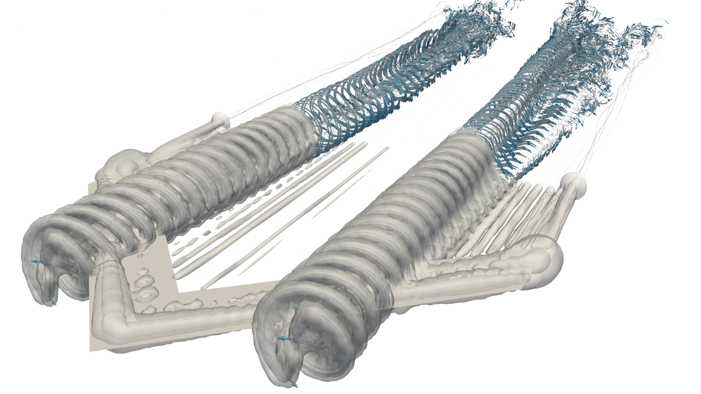
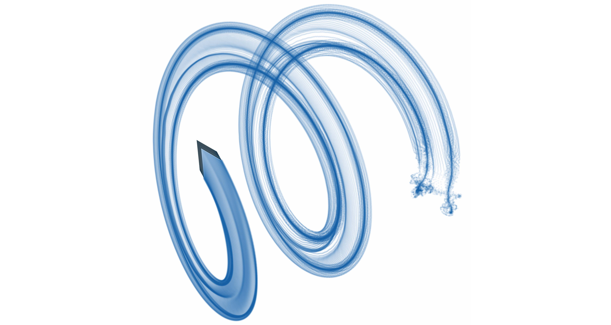
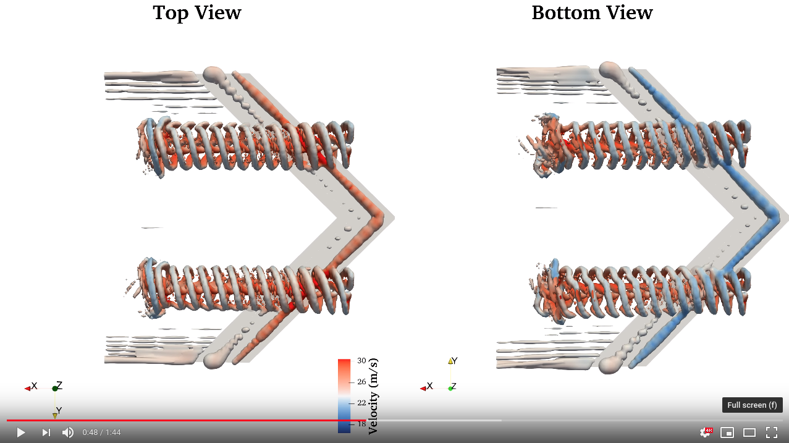

# FLOW Unsteady Aerodynamics Suite

Simulation engine of mixed-fidelity unsteady aerodynamics and aeroacoustics.
This suite brings together mid and high-fidelity
aerodynamics tools developed at BYU's [FLOW Lab](http://flow.byu.edu/): [`GeometricTools`](https://github.com/byuflowlab/GeometricTools.jl)
(geometric engine), [`FLOWVLM`](https://github.com/byuflowlab/FLOWVLM) (VLM and
strip theory solver), [`CCBlade`](https://github.com/byuflowlab/CCBlade.jl)
(blade element momentum solver),
[`MyPanel`](https://github.com/EdoAlvarezR/MyPanel.jl) (3D inviscid panel
solver), and `FLOWVPM` (viscous vortex particle method). The aeroacoustic
solver integrates PSU-WOPWOP (FW-H solver) and [`FLOWNoise`](https://github.com/byuflowlab/FLOWNoise).

This module is written in Julia 0.6.4 since most of the codes are still using
Julia 0.6.4 as they are pending for a major revamp.

**FEATURES**
* Viscous, unsteady wake mixing of rotors and lifting surfaces.
* Fully resolved rotor-on-rotor, rotor-on-wing, wing-on-rotor, and wing-on-wing
interactions.
* Fully resolved unsteady loads during prescribed kinematic maneuvers.

**LIMITATIONS**
* Viscous drag and separation is only captured through strip theory, without
attempting to shed separation wakes.
* No viscous drag is captured through VLM and panel models.

**FUTURE WORK**
* Coupling of aerodynamic loads and flight path allowing dynamic simulations.
* Bluff body separation and panel-predicted viscous drag (?).

For validation and numerical recommendations, check this notebook in the
documentation: [`docs/resources/validation.ipynb`](https://nbviewer.jupyter.org/github/byuflowlab/FlightVehicleSim/blob/master/docs/resources/validation.ipynb).

For example simulations, check this notebook: [`docs/resources/examples.ipynb`](https://nbviewer.jupyter.org/github/byuflowlab/FlightVehicleSim/blob/master/docs/resources/examples.ipynb).

# Folders and Files
  * `src/`: Source code.
  * `examples/`: Example simulations.
  * `docs/resources/`: Documentation (open Jupyter notebooks with [nbviewer](https://nbviewer.jupyter.org/)).
    - `docs/resources/instructions-setup.md`: Instructions for setting up this package.
    - [`docs/resources/validation.ipynb`](https://nbviewer.jupyter.org/github/byuflowlab/FlightVehicleSim/blob/master/docs/resources/validation.ipynb): Validation of models implemented in this package and numeric observations.
    - [`docs/resources/examples.ipynb`](https://nbviewer.jupyter.org/github/byuflowlab/FlightVehicleSim/blob/master/docs/resources/examples.ipynb): Results of example simulations.

# Dependencies
  * [`GeometricTools`](https://github.com/byuflowlab/GeometricTools.jl)
  * [`FLOWVLM`](https://github.com/byuflowlab/FLOWVLM)
  * [`MyPanel`](https://github.com/EdoAlvarezR/MyPanel.jl)
  * `FLOWVPM`: Contact [Ed Alvarez](http://edoalvarez.com) or the FLOW Lab.
  * Paraview  : Not needed, but examples call Paraview for visualization of
      outputs.

# Related Projects
  * [Unsteady eVTOL transition](https://github.com/byuflowlab/alvarezanderson2020-unsteady-evtol-transition)
  * [Wind-harvesting aircraft design](https://github.com/byuflowlab/mehr2020-airborne-wind-aero)

# Examples
**HEAVING WING:** `examples/heavingwing.jl`

**CROSS-WIND CIRCULAR PATH:** `examples/circularpath.jl`

**HOVERING ROTOR:** `examples/singlerotor.jl`

**INTERACTING TANDEM HEAVING WING:** `examples/tandemheavingwing.jl`

**BLOWN WING:** `examples/blownwing/blownwing.jl`

**eVTOL TRANSITION:** `examples/vahana/vahana.jl` (in progress)

# Framework Flowchart

# Publications
  * Alvarez, E. J., & Ning, A. (2021, in progress). <i>Unsteady Mixed-fidelity Aerodynamics Solver
for Maneuvering Multirotor Aircraft</i>. AIAA SciTech Forum. <a href="https://github.com/byuflowlab/FLOWUnsteady/blob/master/docs/resources/AlvarezNing_2021-SciTechAbstract-FLOWUnsteady_solver.pdf"><b>[PDF]</b></a>  
  * Alvarez, E. J., (2020). <i>Quasi-steady Aerodynamics Solver for a High-fidelity Controls Framework</i>. FLOWUnsteady Documentation. <a href="https://github.com/byuflowlab/FLOWUnsteady/blob/master/docs/resources/quasisteadysolver.pdf"><b>[PDF]</b></a>  
  * Alvarez, E. J., & Ning, A. (2020, accepted). <i>High-fidelity Modeling of Multirotor Aerodynamic Interactions for Aircraft Design</i>. AIAA Journal. <a href="https://byu.box.com/shared/static/s4h4w165x4vlxcmhgmxi05ngq0qab9o0.pdf"><b>[PDF]</b></a>  
  * Alvarez, E. J., & Ning, A. (2019). <i>Modeling Multirotor Aerodynamic Interactions Through the Vortex Particle Method</i>. AIAA AVIATION Forum. DOI: <a href="https://doi.org/10.2514/6.2019-2827 ">10.2514/6.2019-2827</a> <a href="http://edoalvar2.groups.et.byu.net/public/AlvarezNing_2019-AVIATION-Multirotor_aerodynamic_interactions_through_VPM-STATIC.pdf"><b>[SLIDES]</b></a><a href="https://scholarsarchive.byu.edu/facpub/3191/"><b>[PDF]</b></a>  
  * Alvarez, E. J., & Ning, A. (2018). <i>Development of a Vortex Particle Code for the Modeling of Wake Interaction in Distributed Propulsion</i>. AIAA AVIATION Forum. DOI: <a href="https://doi.org/10.2514/6.2018-3646 ">10.2514/6.2018-3646</a> <a href="http://www.et.byu.edu/~edoalvar/public/AlvarezNing_2018-AIAA-VPM_distibuted_propulsion-SLIDE-static.pdf"><b>[SLIDES]</b></a><a href="https://scholarsarchive.byu.edu/facpub/2116/"><b>[PDF]</b></a>  

# Authorship
  * Main developer    : Eduardo J Alvarez
  * Email             : Edo.AlvarezR@gmail.com
  * Website           : [edoalvarez.com](https://www.edoalvarez.com/)
  * Created           : Oct 2019
  * License           : MIT License
