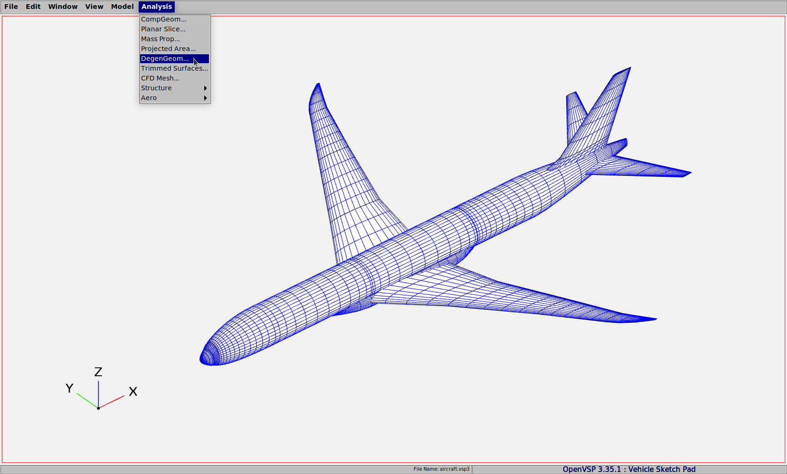
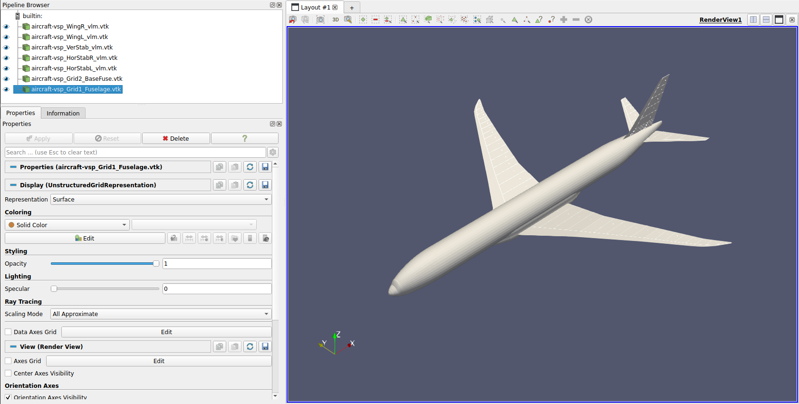

# OpenVSP Geometry

In this example, we import an aircraft model created in OpenVSP into the FLOWUnsteady environment. The `aircraft.vsp3` file made use of here is available in the folder `database/aircraft-vsp/` in the FLOWUnsteady Github repo.

After creating the aircraft geometry in OpenVSP, we write out a DegenGeom file using the tab Analysis > DegenGeom as shown below. This creates a CSV file that contains all the components of the aircraft geometry.



Let's import the geometry into Julia using the `read_degengeom` function and inspect it.
```@example inspect
import FLOWUnsteady as uns

geom_path = joinpath(uns.examples_path, "aircraft-vsp", "aircraft.csv")
comp = uns.read_degengeom(geom_path);

for i in 1:length(comp)
  println("$i. $(comp[i].name)")
end
```

Now that we have a good idea about the index of the components in the geometry, we can use them in FLOWUnsteady using the function `import_vsp`. The following example script imports the OpenVSP geometry, creates FLOWUnsteady data structures and writes it out to a vtk file. The geometry can be used with the FLOWUnsteady solver by following one of the previous examples.

```julia
#=##############################################################################
# DESCRIPTION
    Import of OpenVSP geometry into FLOWUnsteady

# AUTHORSHIP
  * Author          : Cibin Joseph
  * Email           : cibinjoseph92@gmail.com
  * Created         : Aug 2023
  * Last updated    : Aug 2023
  * License         : MIT
=###############################################################################

import FLOWUnsteady as uns

run_name        = "aircraft-vsp"            # Name of this simulation
save_path       = run_name                  # Where to save this simulation

# Path to DegenGeom file
geom_path = joinpath(uns.examples_path, "aircraft-vsp", "aircraft.csv")

Vinf(X, t)      = [1.0, 0.0, 0.0]  # Freestream function

# ----------------- 1) VEHICLE DEFINITION --------------------------------------
println("Importing geometry...")

# Import VSP Components from DegenGeom file
comp = uns.read_degengeom(geom_path);

fuselage = uns.import_vsp(comp[1])
wingL = uns.import_vsp(comp[2])
wingR = uns.import_vsp(comp[2]; flip_y=true)
basefuse = uns.import_vsp(comp[4])
horstabL = uns.import_vsp(comp[5])
horstabR = uns.import_vsp(comp[5]; flip_y=true)
verstab = uns.import_vsp(comp[7])

println("Generating vehicle...")

# Generate vehicle
system = uns.vlm.WingSystem()                   # System of all FLOWVLM objects
uns.vlm.addwing(system, "WingL", wingL)
uns.vlm.addwing(system, "WingR", wingR)
uns.vlm.addwing(system, "HorStabL", horstabL)
uns.vlm.addwing(system, "HorStabR", horstabR)
uns.vlm.addwing(system, "VerStab", verstab)

fuse_grid = uns.gt.MultiGrid(3)
uns.gt.addgrid(fuse_grid, "Fuselage", fuselage)

basefuse_grid = uns.gt.MultiGrid(3)
uns.gt.addgrid(basefuse_grid, "BaseFuse", basefuse)

grids = [fuse_grid, basefuse_grid]

vlm_system = system                         # System solved through VLM solver
wake_system = system                        # System that will shed a VPM wake

vehicle = uns.VLMVehicle(   system;
                            vlm_system=vlm_system,
                            wake_system=wake_system,
                            grids=grids
                         )

# ----------------- 2) GEOMETRY EXPORT -----------------------------------------
rm(save_path, recursive=true, force=true)
mkdir(save_path)

uns.vlm.setVinf(system, Vinf)
uns.save_vtk(vehicle, run_name; path=save_path)
```


