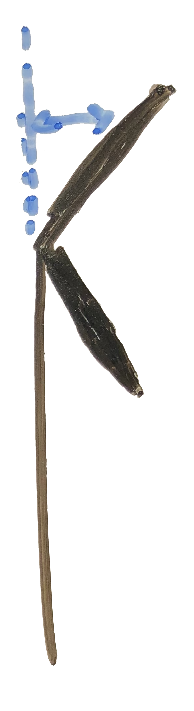

# Define a Rotor


Modules used:

- GeometricTools
- VLM


If you'd like to simulate any type of rotor, say a propeller, fan or turbine, you define your parameters, setup the simulation and then run the simulation. As with previous tasks, here we go through each step, but adding two rotors to the hershey bar wing. 


## Parameters

First you will need to define all of the parameters that dictate the geometry and aerodynamic qualities of your rotor. Most of the information that defines your rotor is included in a database. FlowUnsteady includes a modest database of rotors including propellers and turbine blades. If you need a rotor outside of the database, see below on how to add a custom rotor.

1. Initialize FlowUnsteady and define the rotor file, input and output paths, and run name. 

```julia
import FLOWUnsteady
uns = FLOWUnsteady
vlm = uns.vlm

import GeometricTools
gt = GeometricTools


# ------ PARAMETERS ---------
# Rotor Geometry
rotor_file = "DJI-II.csv" 						#Rotor Geometry
data_path = uns.def_data_path 				#Path to rotor database
run_name = "singlerotor"
```


2. Define rotor parameters. 

   *Note that the parameters must match what is given in the rotor definition files, otherwise the simulation will fail or provide incorrect results.* 

``` julia
pitch = 0.0 						#(deg) collective blade pitch
n			= 10 							# Number of blade elements
CW 		= false 					# Clock-wise rotation
```


*Some rotor geometry values can be read directly from the rotor file, preventing some error due to mismatched data.*

```julia
R, B = uns.read_rotor(rotor_file; data_path=data_path)[[1,3]]
```


3. Define simulation parameters according to your situation:

```julia
RPM = 5000                          # RPM
J   = 0.0                           # Advance ratio Vinf/(nD)
rho = 1.225                         # (kg/m^3) air density
mu  = 1.81e-5                       # (kg/ms) air dynamic viscosity
ReD = 2*pi*RPM/60*R * rho/mu * 2*R  # Tip-based Reynolds number
```


4. Define a function that describes freestream velocity.

```julia
Vinf(x,t) = [20, 0, 0] 							#(m/s) freestream velocity [soley x direction]
```

*Note that this function can describe the free stream dependent on distance or time, here we simply declare a constant freestream velocity.* 


5. Define the solver parameters. 

```julia
# Solver parameters
nrevs = 6                           # Number of revolutions in simulation
nsteps_per_rev = 72                 # Time steps per revolution
p_per_step = 2                      # Sheds per time step
ttot = nrevs/(RPM/60)               # (s) total simulation time
nsteps = nrevs*nsteps_per_rev       # Number of time steps
lambda = 2.125                      # Core overlap
overwrite_sigma = lambda * 2*pi*R/(nsteps_per_rev*p_per_step) # Smoothing core size
surf_sigma = R/10                   # Smoothing radius of lifting surface
vlm_sigma = surf_sigma              # Smoothing radius of VLM
shed_unsteady = true                # Shed particles from unsteady loading

max_particles = ((2*n+1)*B)*nrevs*nsteps_per_rev*p_per_step # Max particles for memory pre-allocation
plot_disc = true                    # Plot blade discretization for debugging

xfoil = true 												# Generate airfoil polars for BEM
verbose = true 											# Echo status periodically
```


## Simulation Setup 

6. Now using all of the parameters previously defined, generate the rotor system. 

   *Every object must be added to a wing system, so here we create an empty wing system and add the rotor. Objects included in the wing system will not explicitly be included in the solution, but will be included in visualization.*

```julia
# ------------ SIMULATION SETUP --------------------------------------------
# Generate rotor
rotor = uns.generate_rotor(rotor_file; pitch=pitch,
                                            n=n, CW=CW, ReD=ReD,
                                            verbose=verbose, xfoil=xfoil,
                                            data_path=data_path,
                                            plot_disc=plot_disc)
# Systems of rotors
rotors = vlm.Rotor[rotor]   # Defining this rotor as its own system
rotor_systems = (rotors,)

# ----- VEHICLE DEFINITION
# System of all FLOWVLM objects
system = vlm.WingSystem()
vlm.addwing(system, run_name, rotor)

```


7. Create a wake_system. 

   *Any object that sheds a wake must be added to the wake_system.*

```julia
# Wake-shedding system (doesn't include the rotor if quasi-steady vehicle)
wake_system = vlm.WingSystem()

if VehicleType != uns.QVLMVehicle
    vlm.addwing(wake_system, run_name, rotor)
else
   # Mute colinear warnings. This is needed since the quasi-steady solver
   #   will probe induced velocities at the lifting line of the blade
    uns.vlm.VLMSolver._mute_warning(true)
end
```


8. Generate a vehicle object out of the rotor system and wake. 

   *If you were generating other bodies such as wings, an aircraft body or a turbine tower, you would first create those and generate the vehicle object with those included.*

```julia
# FVS's Vehicle object
vehicle = VehicleType(   system;
                            rotor_systems=rotor_systems,
                            wake_system=wake_system
                         )
```


9. Generate maneuver definition. 

   *The simulation needs a maneuver, which is covered in a different guide. Here we simply create a maneuver that will keep the rotor at a constant RPM, not tilt, or translate.*

```julia
    # ----- MANEUVER DEFINITION
    RPM_fun(t) = 1.0                # RPM (normalized by reference RPM) as a
                                    # function of normalized time

    angle = ()                      # Angle of each tilting system (none in this case)
    sysRPM = (RPM_fun, )              # RPM of each rotor system
    Vvehicle(t) = zeros(3)          # Translational velocity of vehicle over Vcruise
    anglevehicle(t) = zeros(3)      # (deg) angle of the vehicle

    # FVS's Maneuver object
    maneuver = uns.KinematicManeuver(angle, sysRPM, Vvehicle, anglevehicle)
```


10. Create a simulation object for the simulator to run.

```julia
    # ----- SIMULATION DEFINITION
    RPMref = RPM
    Vref = 0.0
    simulation = uns.Simulation(vehicle, maneuver, Vref, RPMref, ttot)
```


## Run Simulation

Call the simulation function on the parameters and options you've defined.

```julia
    # ------------ RUN SIMULATION ----------------------------------------------
    pfield = uns.run_simulation(simulation, nsteps;
                                      # SIMULATION OPTIONS
                                      Vinf=Vinf,
                                      # SOLVERS OPTIONS
                                      p_per_step=p_per_step,
                                      overwrite_sigma=overwrite_sigma,
                                      vlm_sigma=vlm_sigma,
                                      surf_sigma=surf_sigma,
                                      max_particles=max_particles,
                                      shed_unsteady=shed_unsteady,
                                      # OUTPUT OPTIONS
                                      save_path=nothing,
                                      run_name=run_name,
                                      prompt=true,
                                      verbose=true,
  																		v_lvl=0,
                                      )
```


After visualization, you should get a result similar to this. 


## Adding a Custom Rotor

It is likely that the rotors defined in the repository database do not match your needs, in that case, you will need to provide all of the information to define the rotor in a series of files. The files must be defined in the correct format and directory structure for FlowUnsteady to find it all. If you are unfamiliar with creating file trees, I suggest adding your files directly to the correct directories, however a seperate file structure can easily be used. 

### Database Structure

1. Create you custom rotor files
2. Add them to the correct directories

#### If using a custom database...

1. Create the data structure shown below.
2. Complete the steps above.

3. When initializing the data path (step 1 of defining a rotor), set the data path to the address of the "data" directory 


The database can be found as a subdirectory of the FlowUnsteady package. 

```shell
../FlowUnsteady/data
```


| MainFile.csv      | =>   | ../data/rotors   |
| ----------------- | ---- | ---------------- |
| Airfoils.csv      | =>   | ../data/rotors   |
| Blade.csv         | =>   | ../data/rotors   |
| ChordDist.csv     | =>   | ../data/rotors   |
| HeightDist.csv    | =>   | ../data/rotors   |
| PitchDist.csv     | =>   | ../data/rotors   |
| SweepDist.csv     | =>   | ../data/rotors   |
| AirfoilGeo1.csv*  | =>   | ../data/airfoils |
| AirfoilGeo2.csv   | =>   | ../data/airfoils |
| AirfoilGeox.csv   | =>   | ../data/airfoils |
| AirfoilPol1.dat** | =>   | ../data/airfoils |
| AirfoilPol2.dat   | =>   | ../data/airfoils |
| AirfoilPolx.dat   | =>   | ../data/airfoils |

*Note: This can be as many geometry files as you would like to include along the blade.

**Note: Airfoil Polars are needed if xfoil is set to false. An airfoil polar must be provided for every airfoil.


## Creating a Custom Rotor

If you do not already have the rotor files to describe your rotor, then you will need to create them. Here we will go through each file type and what to put in them. It is important to note that file name and types are not important, however they must be comma delimited.  We will use the DJI-II from the FLOWUnsteady database as an example. 

It is important to note that if XFOIL is not run (marked false), then airfoil polars must be provided. The files that affect solution outcome are the chord distribution, pitch distribution, leading edge distribution, and airfoil polar files. If XFOIL is marked to run, all of the geometric material must be accurate. 

#### MainFile.csv

The main file describes the overall rotor, and points to the blade file that describes one of the blades. 

| property | file             | description             |
| -------- | ---------------- | ----------------------- |
| Rtip     | 0.75             | (m) Radius of blade tip |
| Rhub     | 0.0375           | (m) Radius of hub       |
| B        | 3                | Number of blades        |
| blade    | DJI-II_blade.csv | Blade file              |

 

#### Blade.csv

The main file points to all of the files that desribe the blade and spline parameters. 

| property      | file                  | description            |
| ------------- | --------------------- | ---------------------- |
| chorddist     | DJI-II_chorddist.csv  | Chord distribution     |
| pitchdist     | DJI-II_pitchdist.csv  | Pitch distribution     |
| sweepdist     | DJI-II_sweepdist.csv  | LE sweep distribution  |
| heightdist    | DJI-II_heightdist.csv | LE height distribution |
| airfoil_files | DJI-II_airfoils.csv   | Airfoil distribution   |
| spl_k         | 1                     | Spline order           |
| spl_s         | 2.0e-7                | Spline smoothing       |


#### ChordDist.csv

This file provides the distribution of the chord along the blade, normalized by the radius of the blade. The file must go in order of root to tip. The root need not be defined, but the tip must be. The file can have any number of paired numbers. Any values used by the solver that are not provided will be interpolated. 

| r/R       | c/R       |
| --------- | --------- |
| 0.0411523 | 0.121011  |
| 0.0685871 | 0.138171  |
| ...       | ...       |
| 1.0       | 0.0978361 |


#### PitchDist.csv

This file describes the twist of the blade along the blade. The file can have any number of paired numbers. Any values used by the solver that are not provided will be interpolated. 

| r/R       | twist (deg) |
| --------- | ----------- |
| 0.0411523 | 16.4567     |
| 0.0685871 | 17.5        |
| ...       | ...         |
| 1.0       | 11.6        |


#### SweepDist.csv

This file describes the sweep distribution. This is also known as the leading edge distribution, it describes the distance of the the leading edge from a line coming from the center of the hub. These lines change depending on how many blades are included on a rotor (see photo below for example of a the rotor with 3 blades). The file can have any number of paired numbers. Any values used by the solver that are not provided will be interpolated. 


| r/R       | y/R (y-distance of LE from the middle point of hub) |
| --------- | --------------------------------------------------- |
| 0.0411523 | 0.0576211                                           |
| 0.0685871 | 0.0605955                                           |
| ...       | ...                                                 |
| 1.0       | 0.0344412                                           |


#### HeightDist.csv

This file describes the height distribution, also known as anhedral (or precode for turbines). This describes the height of the leading edge from the top face of the hub. The file can have any number of paired numbers. Any values used by the solver that are not provided will be interpolated. 



| r/R       | z/R (height of LE from the top face of hub) |
| --------- | ------------------------------------------- |
| 0.0686391 | -0.00242965                                 |
| 0.2       | 0.00728895                                  |
| ...       | ...                                         |
| 1.0       | -0.0242965                                  |


#### Airfoil_Files.csv

This file describes the airfoils along the blade and the paired aero file that goes with the contour file. The contour file is a file of the geometric shape of the airfoil. The aero file is the airfoil polar, the file that has the coefficient of lift, drag and moment for a given set of angles of attack for the airfoil. Note that the information is interpolated, so airfoils between two stated airfoils will be an interpolation between the two. If XFOIL is marked to run, then the aero files will not be used. As many pairs of airfoil files as desired may be used. 

| r/R  | Contour file | Aero file               |
| ---- | ------------ | ----------------------- |
| 0.0  | e856-il.csv  | xf-e856-il-50000-n5.csv |
| 0.3  | e63.csv      | xf-e63-il-50000-n5.csv  |
| 1.0  | e63.csv      | xf-e63-il-50000-n5.csv  |


#### AirfoilGeoFile.csv

This file describes the geometry of the airfoil by giving x and y coordinates of the airfoil surface. These coordinates are normalized by the chord length. The order of the points should be trailing edge, upper surface, leading edge, lower surface, then trailing edge. As many coordinate pairs as desired may be used, all other points used will be interpolated. 

| x/c     | y/c     |
| ------- | ------- |
| 1.0     | 0.0     |
| 0.99619 | 0.00144 |
| ...     | ...     |
| 1.0     | 0.0     |


#### AirfoilPolarFile.dat

This file contains all of the airfoils' coefficients of lift, drag and moment for a given set of angles of attack for the airfoil. Values that are required but not given will be interpolated. Note that the polar should match the general Reynolds number that the given section will experience. If XFOIL is set to run, this file will not be used. This is the only file that is not a comma delimited file. 

```shell
DU21 airfoil with an aspect ratio of 17.  Original -180 to 180deg Cl, Cd, and Cm versus AOA data taken from Appendix A of DOWEC document 10046_009.pdf (numerical values obtained from Koert Lindenburg of ECN).
Cl and Cd values corrected for rotational stall delay and Cd values corrected using the Viterna method for 0 to 90deg AOA by Jason Jonkman using AirfoilPrep_v2p0.xls.
one more line
 1        	 Number of airfoil tables in this file
 1.0      	 Reynolds numbers in millions
 0.0      	 Control setting
 8.0      	 Stall angle (deg)
-5.0609      Zero lift angle of attack (deg)
 6.2047      Cn slope for zero lift (dimensionless)
 1.4144      Cn at stall value for positive angle of attack
-0.5324      Cn at stall value for negative angle of attack
-1.50        Angle of attack for minimum CD (deg)
 0.0057   Minimum CD value
-180.00    0.000   0.0185   0.0000
-175.00    0.394   0.0332   0.1978
-160.00    0.670   0.2809   0.2738
  ...				...			...				...
```


