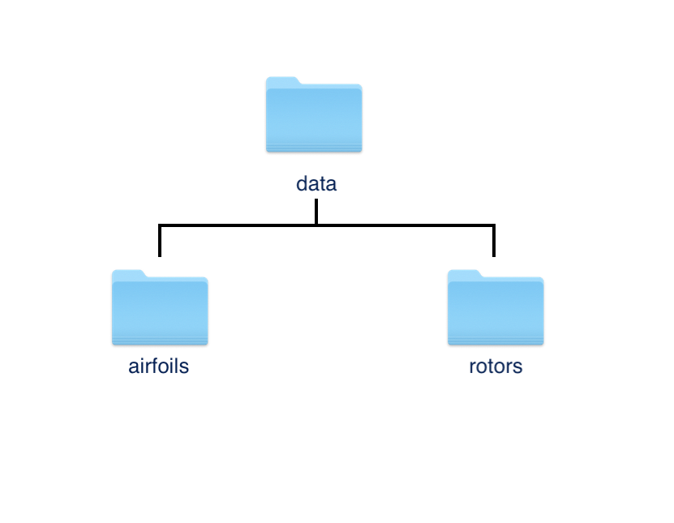

# Advanced Rotor Definition


Modules used:

- GeometricTools
- VLM


If you'd like to simulate any type of rotor, say a propeller, fan or turbine, you define your parameters, setup the simulation and then run the simulation. As with previous tasks, here we go through each step, but adding two rotors to the hershey bar wing.


## Parameters

First you will need to define all of the parameters that dictate the geometry and aerodynamic qualities of your rotor. Most of the information that defines your rotor is included in a database. FlowUnsteady includes a modest database of rotors including propellers and turbine blades. If you need a rotor outside of the database, see below on how to add a custom rotor.

1. Initialize FlowUnsteady and define the rotor file, input and output paths, and run name.

```julia
import FLOWUnsteady
uns = FLOWUnsteady
vlm = uns.vlm

import GeometricTools
gt = GeometricTools


# ------ PARAMETERS ---------
# Rotor Geometry
rotor_file = "DJI-II.csv" 						#Rotor Geometry
data_path = uns.def_data_path 				#Path to rotor database
run_name = "singlerotor"
```


2. Define rotor parameters.

   *Note that the parameters must match what is given in the rotor definition files, otherwise the simulation will fail or provide incorrect results.*

``` julia
pitch = 0.0 						#(deg) collective blade pitch
n			= 10 							# Number of blade elements
CW 		= false 					# Clock-wise rotation
```


*Some rotor geometry values can be read directly from the rotor file, preventing some error due to mismatched data.*

```julia
R, B = uns.read_rotor(rotor_file; data_path=data_path)[[1,3]]
```


3. Define simulation parameters according to your situation:

```julia
RPM = 5000                          # RPM
J   = 0.0                           # Advance ratio Vinf/(nD)
rho = 1.225                         # (kg/m^3) air density
mu  = 1.81e-5                       # (kg/ms) air dynamic viscosity
ReD = 2*pi*RPM/60*R * rho/mu * 2*R  # Tip-based Reynolds number
```


4. Define a function that describes freestream velocity.

```julia
Vinf(x,t) = [20, 0, 0] 							#(m/s) freestream velocity [soley x direction]
```

*Note that this function can describe the free stream dependent on distance or time, here we simply declare a constant freestream velocity.*


5. Define the solver parameters.

```julia
# Solver parameters
nrevs = 6                           # Number of revolutions in simulation
nsteps_per_rev = 72                 # Time steps per revolution
p_per_step = 2                      # Sheds per time step
ttot = nrevs/(RPM/60)               # (s) total simulation time
nsteps = nrevs*nsteps_per_rev       # Number of time steps
lambda = 2.125                      # Core overlap
overwrite_sigma = lambda * 2*pi*R/(nsteps_per_rev*p_per_step) # Smoothing core size
surf_sigma = R/10                   # Smoothing radius of lifting surface
vlm_sigma = surf_sigma              # Smoothing radius of VLM
shed_unsteady = true                # Shed particles from unsteady loading

max_particles = ((2*n+1)*B)*nrevs*nsteps_per_rev*p_per_step # Max particles for memory pre-allocation
plot_disc = true                    # Plot blade discretization for debugging

xfoil = true 												# Generate airfoil polars for BEM
verbose = true 											# Echo status periodically
```


## Simulation Setup

6. Now using all of the parameters previously defined, generate the rotor system.

   *Every object must be added to a wing system, so here we create an empty wing system and add the rotor. Objects included in the wing system will not explicitly be included in the solution, but will be included in visualization.*

```julia
# ------------ SIMULATION SETUP --------------------------------------------
# Generate rotor
rotor = uns.generate_rotor(rotor_file; pitch=pitch,
                                            n=n, CW=CW, ReD=ReD,
                                            verbose=verbose, xfoil=xfoil,
                                            data_path=data_path,
                                            plot_disc=plot_disc)
# Systems of rotors
rotors = vlm.Rotor[rotor]   # Defining this rotor as its own system
rotor_systems = (rotors,)

# ----- VEHICLE DEFINITION
# System of all FLOWVLM objects
system = vlm.WingSystem()
vlm.addwing(system, run_name, rotor)

```


7. Create a wake_system.

   *Any object that sheds a wake must be added to the wake_system.*

```julia
# Wake-shedding system (doesn't include the rotor if quasi-steady vehicle)
wake_system = vlm.WingSystem()

if VehicleType != uns.QVLMVehicle
    vlm.addwing(wake_system, run_name, rotor)
else
   # Mute colinear warnings. This is needed since the quasi-steady solver
   #   will probe induced velocities at the lifting line of the blade
    uns.vlm.VLMSolver._mute_warning(true)
end
```


8. Generate a vehicle object out of the rotor system and wake.

   *If you were generating other bodies such as wings, an aircraft body or a turbine tower, you would first create those and generate the vehicle object with those included.*

```julia
# FVS's Vehicle object
vehicle = VehicleType(   system;
                            rotor_systems=rotor_systems,
                            wake_system=wake_system
                         )
```


9. Generate maneuver definition.

   *The simulation needs a maneuver, which is covered in a different guide. Here we simply create a maneuver that will keep the rotor at a constant RPM, not tilt, or translate.*

```julia
    # ----- MANEUVER DEFINITION
    RPM_fun(t) = 1.0                # RPM (normalized by reference RPM) as a
                                    # function of normalized time

    angle = ()                      # Angle of each tilting system (none in this case)
    sysRPM = (RPM_fun, )              # RPM of each rotor system
    Vvehicle(t) = zeros(3)          # Translational velocity of vehicle over Vcruise
    anglevehicle(t) = zeros(3)      # (deg) angle of the vehicle

    # FVS's Maneuver object
    maneuver = uns.KinematicManeuver(angle, sysRPM, Vvehicle, anglevehicle)
```


10. Create a simulation object for the simulator to run.

```julia
    # ----- SIMULATION DEFINITION
    RPMref = RPM
    Vref = 0.0
    simulation = uns.Simulation(vehicle, maneuver, Vref, RPMref, ttot)
```


## Run Simulation

Call the simulation function on the parameters and options you've defined.

```julia
    # ------------ RUN SIMULATION ----------------------------------------------
    pfield = uns.run_simulation(simulation, nsteps;
                                      # SIMULATION OPTIONS
                                      Vinf=Vinf,
                                      # SOLVERS OPTIONS
                                      p_per_step=p_per_step,
                                      overwrite_sigma=overwrite_sigma,
                                      vlm_sigma=vlm_sigma,
                                      surf_sigma=surf_sigma,
                                      max_particles=max_particles,
                                      shed_unsteady=shed_unsteady,
                                      # OUTPUT OPTIONS
                                      save_path=nothing,
                                      run_name=run_name,
                                      prompt=true,
                                      verbose=true,
  																		v_lvl=0,
                                      )
```


After visualization, you should get a result similar to this.


## Adding a Custom Rotor

It is likely that the rotors defined in the repository database do not match your needs, in that case, you will need to provide all of the information to define the rotor in a series of files. The files must be defined in the correct format and directory structure for FlowUnsteady to find it all. If you are unfamiliar with creating file trees, I suggest adding your files directly to the correct directories, however a seperate file structure can easily be used.


1. Create your [custom rotor files](@ref custromrotor)
2. Add them to the correct [directories](@ref rotordatabasestructure)

#### If using a custom database...

1. Create the data structure shown below.
2. Complete the steps above.

3. When initializing the data path (step 1 of defining a rotor), set the data path to the address of the "data" directory



The database can be found as a subdirectory of the FlowUnsteady package.

```shell
../FlowUnsteady/data
```


